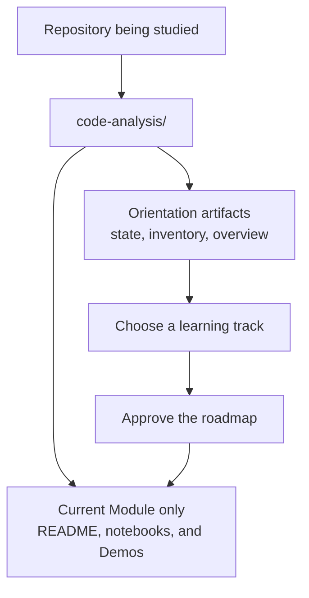

# Codebase Learning

`codebase-learning` turns a real repository into a source-grounded, resumable learning course for Codex.

It is beginner-friendly by default. It defines unfamiliar terms, explains dense syntax, and creates detailed teaching comments in generated Demo code.

## What It Does

- Maps the repository into a source-linked learning course under `code-analysis/`.
- Lets you choose a learning track based on the actual codebase.
- Creates and verifies one Module at a time, so the course can be resumed safely.
- Links explanations, notebooks, and minimal Demos back to real source files and symbols.
- Preserves production source code: course artifacts are written only under `code-analysis/`.

## Install

Install the Skill globally for Codex:

```shell
npx @shuaibilx/codebase-learning
```

To update an existing installation:

```shell
npx @shuaibilx/codebase-learning -- --force
```

Restart Codex after installation.

## Use It in Codex

Open the repository you want to learn, then ask Codex:

```text
Use $codebase-learning to create a source-grounded learning course for this repository.
```

Codex will first map the project and present source-derived learning tracks. It will wait for your approval before creating a roadmap or advancing to the next Module.

## What Codex Creates

Course artifacts are created at `code-analysis/` in the root of the repository being studied. The Skill does not modify production source code, dependencies, lockfiles, or project configuration.

Creation is deliberately staged: Orientation creates the shared course files first. After you approve a roadmap, Codex creates only the current Module. Future Modules remain roadmap entries until you explicitly choose to advance.



### Example Output

For this `codebase-learning` repository, one possible source-derived course could look like this. The actual Module and Lesson names always come from the repository and selected learning track.

```text
codebase-learning/                     # The repository being studied
└── code-analysis/                     # Generated course artifacts
    ├── .codebase-learning/            # Machine-readable course state
    │   ├── state.json                 # Current Gate, track, and Module status
    │   └── inventory.json             # Safe repository inventory and source snapshot
    ├── README.md                      # Course home, progress, and navigation
    ├── 00-project-overview.md         # Project purpose, architecture, and entry points
    ├── 00-file-index.md               # Optional: detailed inventory for large repositories
    └── 01-course-workflow-and-gates/  # Example: the current Module
        ├── README.md                  # Module guide and source evidence
        ├── notebook/
        │   ├── 01-orientation-gate.md
        │   └── 02-course-state.md
        └── demo/
            └── 01-gate-transition/
                ├── README.md          # How this Demo relates to real source code
                └── gate_transition_demo.py
```

The `01-course-workflow-and-gates/` directory above is only an example. It would appear only after roadmap approval, and its exact name, notebooks, and Demo files depend on the selected learning path and the source code.

### Mermaid Diagrams in the Course

The generated course uses Mermaid diagrams where a visual explanation is useful:

- `code-analysis/README.md` shows the learning roadmap, Module dependencies, and progress.
- `00-project-overview.md` shows the system runtime architecture and major call chains.
- Each Module `README.md` can show its internal control flow and data flow.
- A Lesson notebook includes a diagram only when it helps explain one focused concept.

## License

This project is licensed under the [MIT License](LICENSE).
