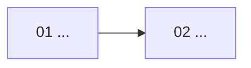

# Artifact Templates

Use these headings as contracts. Adapt content and depth to the repository; do not copy placeholder claims.

## Contents

- Global README
- Project overview
- Module README
- Lesson notebook
- Demo README

## Global README

````markdown
# Codebase Learning

## Current course status
- Scope:
- Learning track:
- Source snapshot:
- Roadmap version:
- Current phase:
- Current Module and revision:
- Next Gate:

## Learning roadmap
- [ ] `01-...` — Learning goal; source scope

## Course dependencies and progress


## Learning rules
## Navigation
## Scan coverage and known limitations
````

Use the global Mermaid diagram for curriculum dependencies and progress, not runtime architecture.

## Project overview

```markdown
# Project Overview

## Analysis scope and source snapshot
## Project purpose
## Technology stack
## Annotated directory tree
## File responsibilities and importance
## System runtime architecture
## Primary entry points and key call chains
## Tests, configuration, and external boundaries
## Available learning tracks
## Scan coverage, exclusions, unknowns, and confidence
```

Use `00-file-index.md` for an exhaustive large-repository inventory when needed. Keep responsibility claims limited to semantically inspected evidence.

## Module README

```markdown
# <NN Module title>

## Roadmap version and Module revision
## Learning goal and completion criteria
## Prerequisites for this Module
## Module glossary
## Why the project needs this
## Place in the system and course
## Source entry points, boundaries, and evidence
## Callers, callees, and data flow
## Module flow diagram
## Lesson order and mapping
| lesson_id | Notebook | Demo(s) | Source evidence | Relationship explanation |
|---|---|---|---|---|
## Key classes, functions, configuration, and tests
## Error paths, tradeoffs, and common misunderstandings
## Demo verification results
## Self-check after learning
```

## Lesson notebook

```markdown
# <NN Lesson title>

## Learning goals and prerequisite knowledge
## Lesson glossary
## Core mechanism and why it exists
## Real execution path in the project
## Source evidence
## Inputs, state changes, and outputs
## Step-by-step code walkthrough
## Key branches and error paths
## Common errors and debugging methods
## Relationship to the minimal Demo
## Common misunderstandings and design tradeoffs
## Practice and self-check questions
## Completion criteria
```

## Demo README

```markdown
# <lesson_id> Demo

## Teaching objective
## Corresponding real source and symbols
## Retained core mechanism
## Removed, substituted, or simulated parts
## Known differences from the production implementation
## Minimal dependencies
## Beginner-friendly run steps
## Guide to code comments
## Run and test commands
## Expected result
## Actual verification record
## Common errors and troubleshooting
## Module revision covered by verification
## Questions for revisiting the real source
```

Do not create empty headings merely to satisfy the template. Supply evidence-backed content or mark the unresolved item explicitly.
