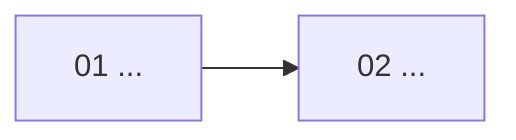

# Artifact Templates

Use these headings as contracts. Adapt content and depth to the repository; do not copy placeholder claims.

## Contents

- Global README
- Project overview
- Module README
- Lesson notebook
- Demo README

## Global README

````markdown
# Codebase Learning

## 当前状态
- 范围：
- 学习方向：
- 源码快照：
- 路线版本：
- 当前阶段：
- 当前模块与 revision：
- 下一道 Gate：

## 学习路线
- [ ] `01-...` — 学习目标；源码范围

## 课程依赖与进度


## 学习规则
## 导航
## 扫描覆盖与已知限制
````

Use the global Mermaid diagram for curriculum dependencies and progress, not runtime architecture.

## Project overview

```markdown
# Project Overview

## 分析范围与源码快照
## 项目作用
## 技术组成
## 带职责注释的目录树
## 文件职责与重要性
## 系统运行架构
## 核心入口与主要调用链
## 测试、配置与外部边界
## 可选学习方向
## 扫描覆盖、排除项、未知项与置信度
```

Use `00-file-index.md` for an exhaustive large-repository inventory when needed. Keep responsibility claims limited to semantically inspected evidence.

## Module README

```markdown
# <NN Module title>

## 路线版本与 Module revision
## 学习目标与完成标准
## 为什么项目需要它
## 在系统与课程中的位置
## 源码入口、边界与证据
## 调用者、被调用者与数据流
## 模块流程图
## Lesson 学习顺序与映射
| lesson_id | Notebook | Demo(s) | 源码证据 | 关系说明 |
|---|---|---|---|---|
## 关键类、函数、配置与测试
## 异常路径、权衡与常见误解
## Demo 验证结果
## 学完后自检
```

## Lesson notebook

```markdown
# <NN Lesson title>

## 学习目标与前置知识
## 核心机制与存在原因
## 项目中的真实执行路径
## 源码证据
## 关键分支与错误路径
## 与最小 Demo 的对应
## 常见误解与设计权衡
## 练习 / 自检问题
## 完成标准
```

## Demo README

```markdown
# <lesson_id> Demo

## 教学目标
## 对应真实源码与符号
## 保留的核心机制
## 删除、替换或模拟的部分
## 与生产实现的已知差异
## 最小依赖
## 运行与测试命令
## 预期结果
## 实际验证记录
## 验证对应的 Module revision
## 回看真实源码的问题
```

Do not create empty headings merely to satisfy the template. Supply evidence-backed content or mark the unresolved item explicitly.
